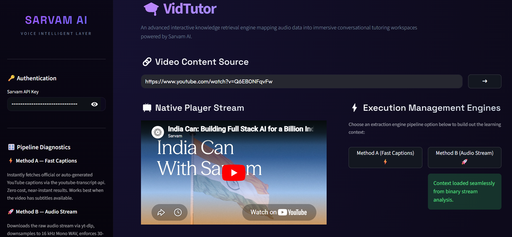
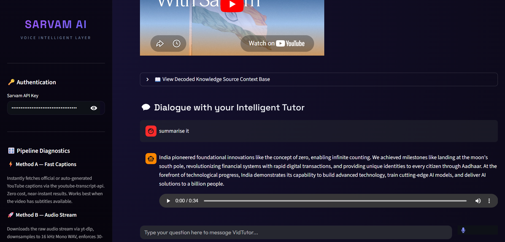

# VidTutor - Sarvam Voice Tutor 🎓




VidTutor is a modern, voice-first educational AI tutor built as an **official developer reference implementation** for Sarvam's EdTech clients. 

In a Customer Success (CS) role, showing prospects exactly "what is possible" is a superpower. This app demonstrates to external developers how to cleanly handle audio chunking, streaming text input, and calling `bulbul:v3` for high-speed, sub-500ms voice responses using Sarvam's REST APIs.

## ✨ Features

- **Premium Glassmorphic UI**: Beautiful, dynamic interface featuring a deep space gradient, interactive equalizer animations, and frosted glass elements.
- **Dual Transcript Extraction**: 
  - ⚡ *Method A (Fast Captions)*: Instant captions via `youtube-transcript-api`. Zero cost and near-instant results.
  - 🚀 *Method B (Audio Stream)*: Full audio download via `yt-dlp` and transcription using Sarvam's `saaras:v3` STT. Downsampled to 16kHz Mono to bypass modern cloud security proxy issues.
- **Strict Grounding**: The tutor answers questions *strictly* based on the video's content, preventing hallucinations.
- **Voice-to-Voice Loop**: Record your voice directly in the browser, get it transcribed, processed, and hear the tutor's response out loud using Sarvam's `bulbul:v3` TTS.
- **Robust API Handling**: Automatically chunks long TTS responses to bypass 500-character limits and dynamically clears UI states for a seamless chat experience.

## ⚙️ Prerequisites

- Python 3.8+
- [Sarvam AI API Key](https://dashboard.sarvam.ai)
- FFmpeg (required for `yt-dlp` audio extraction)

## 🚀 Installation & Setup

1. Clone the repository:
   ```bash
   git clone https://github.com/umaangk13/VidTutor.git
   cd VidTutor
   ```

2. Install the requirements:
   ```bash
   pip install -r requirements.txt
   ```

3. Run the Streamlit application:
   ```bash
   streamlit run app.py
   ```

4. **Activate the Workspace**: Once the app opens, enter your Sarvam API Key in the sleek activation screen to unlock the tutor.

## 📖 Usage Guide

1. Enter a YouTube URL and click the **➜** button.
2. Choose your preferred transcript extraction method (Method A or B).
3. Use the **microphone icon** to speak your question or type it in the chat box.
4. Listen to your tutor's dynamic voice response!

## 📈 Customer Success: Proactive Token Health Monitoring

For a Customer Success Manager (CSM), tracking the "health" of an API integration like this is critical. If an EdTech client deploys VidTutor and their API token consumption suddenly plummets, it's a major churn indicator. 

In such a scenario, a proactive CSM would jump into the Sarvam dashboard analytics to investigate whether students are abandoning the bot due to audio latency, transcript failures (like YouTube IP blocks), or API timeouts. By identifying the bottleneck quickly, the CS team can write custom helper scripts, recommend infrastructure changes, or guide the client's engineering team to unblock their pipeline before they churn.
